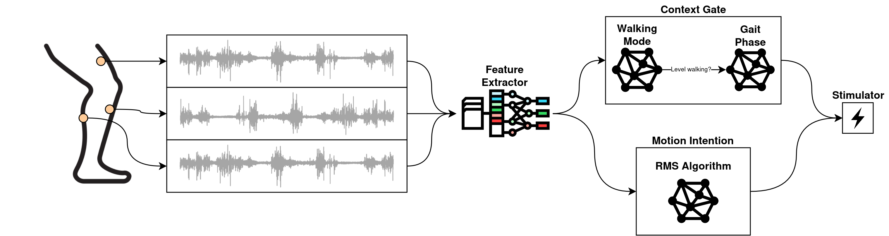
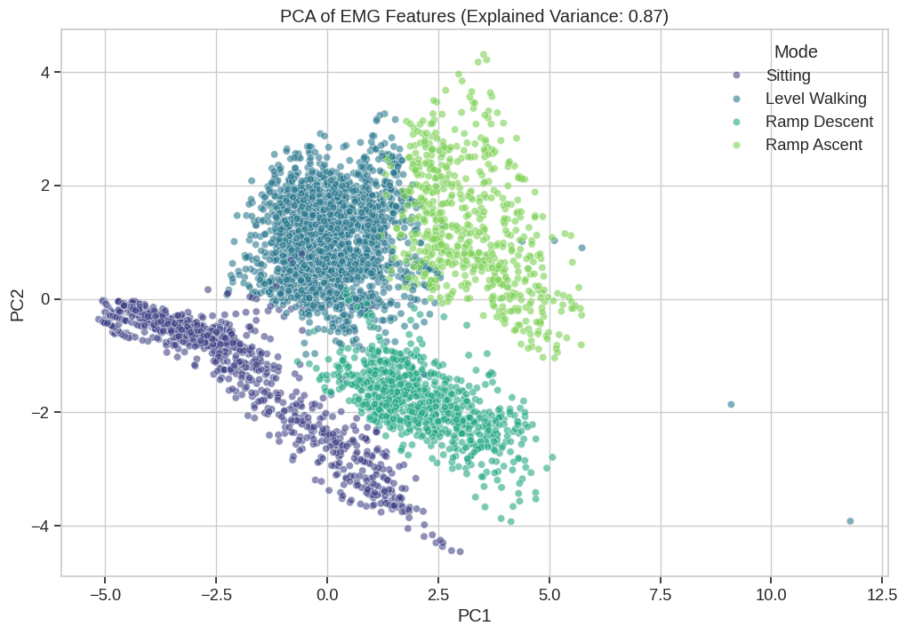
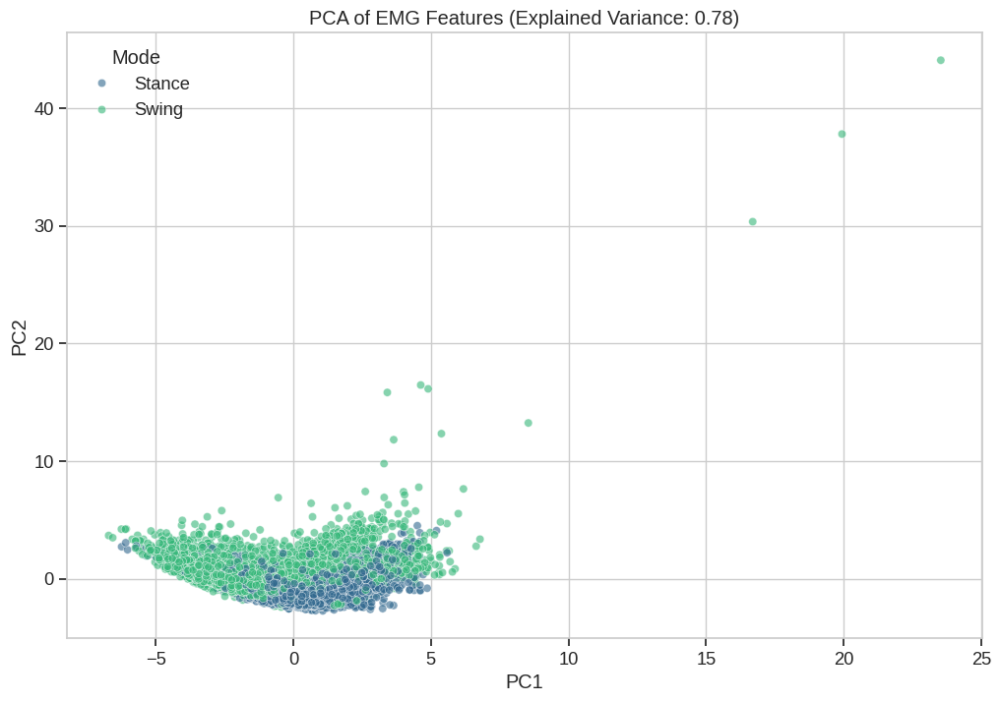
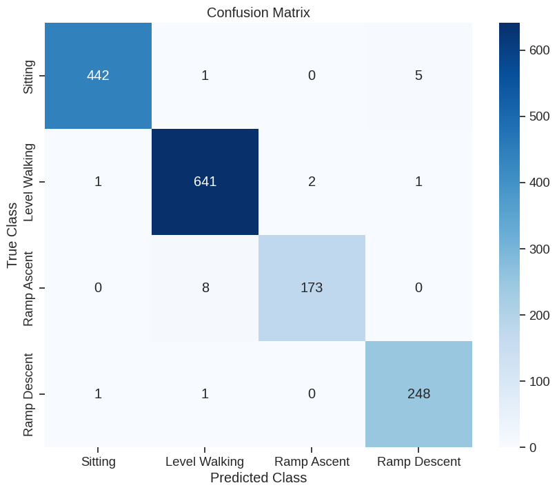
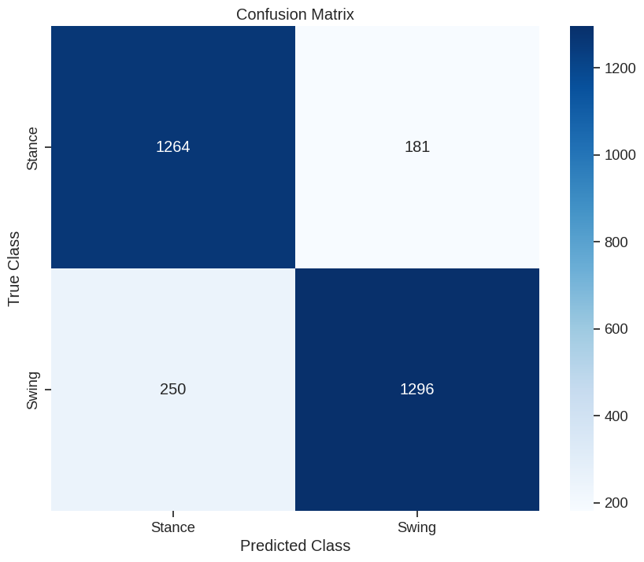

# NeuroGait: Closed-Loop EMG-FES for Gait Rehabilitation

> **Master's Project | Neuroengineering**
> **Focus:** Real-time, low-resource gait intention detection using Surface EMG.

---

## Project Overview
This project develops a **closed-loop control system** for Functional Electrical Stimulation (FES) to assist patients with gait impairments (e.g., Drop Foot). 

Unlike commercial systems that rely on tilt sensors or IMUs, this system uses **only Surface EMG** to detect motor intention and gait phase. It employs a **Cross-Modal Learning** strategy: high-fidelity kinematic data (Goniometers/IMUs) is used *only* during offline training to generate Ground Truth labels, while the final deployed model relies exclusively on lightweight EMG features.



## ⚙️ System Architecture

### 1. Hardware Constraints (Production Environment)
* **Target Platform:** Low-power Microcontroller (e.g., STM32G031).
* **Sensors:** 2 Surface EMG Channels (No IMU/Encoders in final device).
* **Actuator:** FES Unit (Voltage-controlled biphasic stimulation).
* **Requirement:** Real-time processing (<10ms latency) with minimal memory footprint.

### 2. Muscle Configuration (Input)
We utilize 2 specific EMG channels to robustly differentiate gait phases:
1.  **TA (Tibialis Anterior):** Primary indicator for **Swing Phase** (Dorsiflexion).
2.  **MG (Medial Gastrocnemius):** Primary indicator for **Push-off** (Plantarflexion).

---

## Machine Learning Pipeline

### Strategy: Cross-Modal Supervised Learning
We solve the "missing label" problem by using a rich dataset (ENABL3S) where kinematic ground truth exists, to train a model that sees only EMG.

#### Phase 1: Data Ingestion & Labeling (Python / Offline)
* **Dataset:** ENABL3S (Example Subject: `AB156`).
* **Ground Truth Generation:**
    * Load `Ankle_Angle` (Kinematics).
    * **Rule:** If Angle > Threshold ($\approx 0^\circ$ relative to neutral) $\rightarrow$ Label as `SWING (1)`.
    * **Rule:** Else $\rightarrow$ Label as `STANCE (0)`.
* **Input Features ($X$):** Raw EMG from TA, MG, RF.

#### Phase 2: Signal Processing & Feature Engineering
Simulating the embedded firmware environment:
1.  **Pre-processing:**
    * Bandpass Filter: 20-450 Hz.
    * Notch Filter: 50/60 Hz.
    * Rectification: `abs(signal)`.
2.  **Feature Extraction:**
    * **Window Size:** 100ms (Sliding window).
    * **Features:**
        * **MAV** (Mean Absolute Value): Energy metric.
        * **WL** (Waveform Length): Complexity/Onset metric.
        * **RMS** (Root Mean Square): Root meaned square Error.
    * **Input Vector:** `[TA_MAV, TA_RMS, TA_WL, MG_MAV, MG_RMS, MG_WL]` (6 floats).


| Feature PCA (Walking mode) | Feature PCA (Gait Phase) |
|:---:|:---:|
|  |  
|  |  |
| *97% Accuracy Matrix* | *83% Accuracy Matrix* |


#### Phase 3: Classification Model
* **Model Choice:** **Linear Discriminant Analysis (LDA)**.
* **Why?** $O(n)$ complexity, matrix multiplication is native to C++, highly stable.
* **Output:**
    * Model1 -> Probability of walking mode (sitting, standing, level-walking, ramp ascent, ramp descent). 
    * Model2 -> Probability of Swing vs. Stance. 

#### Phase 4: Control Logic (The "Safety Layer")
A **Finite State Machine (FSM)** filters the LDA output to prevent jitter or physiological impossibilities.
* **Illegal Transition:** `Swing` $\rightarrow$ `Push-off` (Must pass through `Heel Strike`).
* **Refractory Period:** Ignore triggers for 200ms after a stimulation event.

---

## Repository Structure

```text
├── embedded/
│ ├── Makefile
│ ├── main.cpp 
│ ├── signal_conditioner.cpp
│ ├── feature_extraction.cpp
│ ├── classifiers.h  
│ └── state_machine.cpp
├── notebooks/  
├── src
│ ├── lib
│ │ ├── data_loader.py
│ │ ├── dataset.py
│ │ ├── features.py
│ │ ├── preprocess.py
│ │ ├── train.py
│ │ ├── utils.py
│ ├── test
│ │ ├── load_channels.py
│ │ ├── verify_preprocessing.py
│ │ ├── view_data.py
│ ├── test
│ │ ├── write_lda_to_c.py
│ │ ├── write_random_forest_to_c.py
│ ├── train_gait_phase_model.py
│ ├── train_walking_mode_model.py
└── data/
```

## Workflow for Agents/Collaborators

1.  **Data Loading**: Use src/data_loader.py to inspect Right_Ankle (Ground Truth) vs Right_TA/MG/RF. Note: Ankle data is in Radians (~1.8 to 2.2 rad).

2.  **Training**: Run train_model.py to generate the decision boundary.

    - Metric: Accuracy > 90% and Recall on "Swing Onset" (Critical for drop foot).

3.  **Porting**: Save the LDA coefficients (W vector and bias b) to embedded/model_n.cpp.

4.  **Simulation**: Test the full pipeline on a "held-out" circuit file to simulate real-time performance.

## Scope & Goals

- Goal: Demonstrate that a low-resource microcontroller can robustly detect gait phases using only 2 muscle channels.

- Success Criteria:

    - Correct detection of Swing Phase onset within 100ms.

    - Rejection of standing/shifting weight (Static balance).

    - Successful simulation of FES trigger signals.